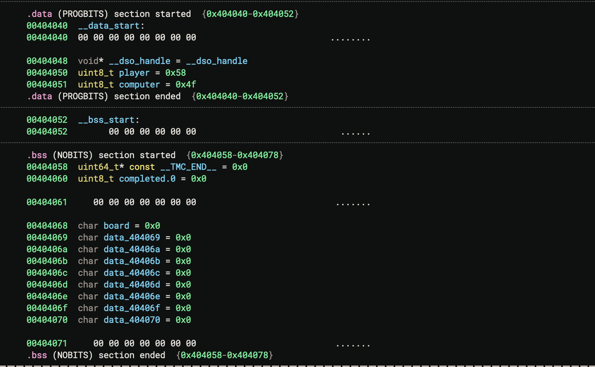

# tic-tac-no

## Summary
This challenge provides a Linux CLI program with a out-of-bounds write vulnerability that allows user to modify variables.

Artifacts:
- `chall/chall`: vulnerable executablew program provided by the challenge authors
- `chall/chall.c`:  vulnerable program surce code provided by challenge authors

## Context 

The challenge has a provided domain and port, but it can also be ran locally using the provided executable. The program intends to be an unbeatable AI by making the most optimal move each time.

Upon running, the program starts a game of tic-tac-toe, prompting the user to input a row and column to make their move.

```
You want the flag? You'll have to beat me first!
   |   |   
---|---|---
   |   |   
---|---|---
   |   |   

Enter row #(1-3): 
```

## Vulnerability
The `chall` program contains a out-of-bound write vulnerability due to an improper check of index within `playerMove()` function.

```
if(index >= 0 && index < 9 && board[index] != ' '){
    printf("Invalid move.\n");
} else {
    board[index] = player; // Should be safe, given that the user cannot overwrite tiles on the board
    break;
}
```

The program checks if a valid index is filled before allowing the user to write to the location. However, it doesn't provide a fail-safe way for invalid indicies.

Therefore, we can use this to input a index that is out of the `board` buffer bound to write to the desired addresses.

On line 122 in `minimax()`, we can see that the computer writes to the board by setting `board[i] = computer`. By modifying the `char computer` variable to be `X`, we can make the computer to write `X`'s on the boards instead of `O`'s to help us win the game of tic-tac-toe.

## Exploitation
The exploit involves inputting an invalid row and column to get an index outside the buffer bound to write to an address of our choice.

By using `Binary Ninja`, we can calculate the offset between the addresses for `board` buffer and `computer` variable.



We can then calculate the offset between `board` (at `0x404068`) and `computer` (at `0x404051`) which turns out to be `-0x17` or -23 in decimal.

Using the index calculation `index = (x - 1) * 3 + (y - 1)` (where x represnents the row input and y represents the column input) on line 84, we can input values for `x` and `y` such that `index` results to `-23`. One example of such input would be `x = -5` and `y=-4`.

By doing so, we write to the address `board[-23]`, or at the location of the variable `computer`, overwriting it to 'X'.

## Remediation
There should be a better check for user inputs rather than just the calculated index value. Instead, the program can check that `row` and `column` are within the bounds [1, 3].